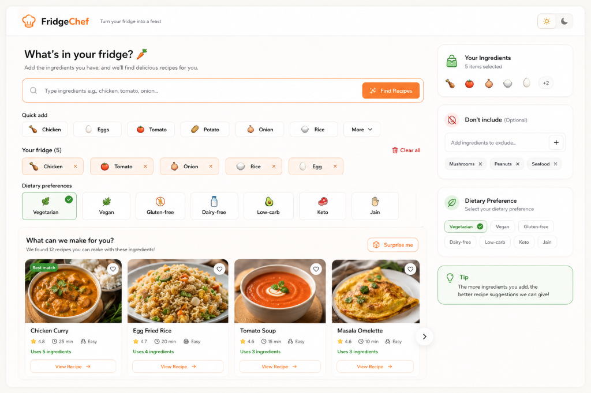
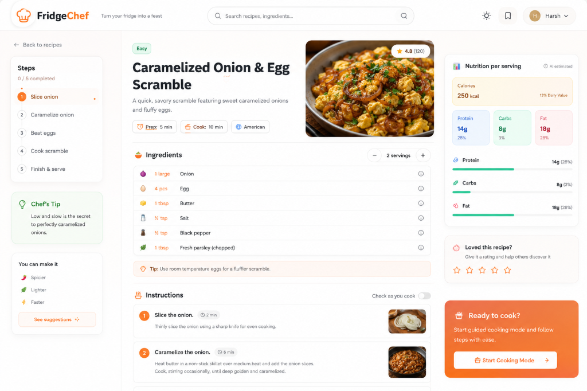

# 🍳 FridgeChef
> Turn your fridge into a feast with AI-powered recipe generation!

A React app that turns your fridge ingredients into a complete, interactive recipe using AI. Not a chatbot — the AI returns structured JSON that powers beautiful, interactive UI components.

   

## 📸 Screenshots

### Front Page - Smart Ingredient Selection


### Recipe Results - Dynamic AI Imagery


## ✨ Premium Features

- **Semantic Ingredient Validation** — fuzzy matching (Levenshtein distance) catches typos (e.g., "chiken" -> "chicken") and blocks non-food items.
- **Dynamic AI Photography** — uses Pollinations AI to instantly generate gorgeous, realistic food photography for your generated recipes and cooking steps.
- **Dietary conflict resolution** — Seamlessly filter recipes based on dietary needs (Vegan, Keto, Gluten-free, etc.) with automatic conflict resolution.
- **Smart ingredient input** — free-form text with auto-parsed chips, pantry quick-adds, and beautiful 3D dietary preference toggles.
- **AI-powered recipe generation** — GPT OSS 120B on Groq (OpenAI-compatible API) with JSON mode (`response_format`) + explicit schema in system prompt for reliable structured output.
- **Serving scaler** — adjust servings with proportional ingredient scaling, smart fraction display (½, ⅓, ¼), and unit conversion at thresholds.
- **Ingredient swaps** — each ingredient shows AI-suggested alternatives with reasons.
- **Step checklist & timers** — check off steps with progress bar, and click any step's duration to start a countdown timer.
- **Cooking Mode** — distraction-free, one-step-at-a-time view for actual cooking.
- **Refinement loop** — modify the existing recipe ("make it spicier", "no dairy") without regenerating from scratch.
- **Mobile responsive & Dark Mode** — works beautifully on all screen sizes with full dark theme support.
- **Robust error handling** — handles malformed JSON, wrong shape, empty responses, timeouts, rate limits, and stale responses

## 🛡️ Error Handling (The Headline Feature)

This app handles AI failure at **multiple layers**:

1. **Groq JSON Mode** — `response_format: { type: "json_object" }` + explicit schema in system prompt guides the model to return valid JSON
2. **Multi-layer JSON extraction** — if parsing fails, tries: direct parse → code fence extraction → brace extraction → JSON fixing
3. **Zod schema validation** — validates every field, fills defaults for missing optional fields, attempts partial recovery
4. **Stale response guard** — request ID tracking prevents old responses from overwriting newer ones
5. **Smart retry** — on failure, lowers temperature and reinforces JSON instructions (3 attempts with exponential backoff)
6. **Abort controller** — 45-second timeout with clean cancellation

| Failure | How it's handled |
|---------|-----------------|
| Network error | Error UI + retry button |
| Rate limit (429) | "Wait X seconds" message |
| Invalid API key | Clear error message |
| Timeout (>45s) | "Taking too long" + retry |
| Malformed JSON | Multi-layer extraction fallback |
| Wrong shape | Zod fills defaults, shows warning banner |
| Empty response | Retry with prompt mutation |
| Stale response | Silently discarded |

## 🚀 Setup

### Prerequisites
- Node.js 18+
- A Groq API key ([get one free](https://console.groq.com/keys))

### Install & Run

```bash
# Clone the repo
git clone <your-repo-url>
cd fridge-to-recipe

# Set up your API key
cp .env.example .env
# Edit .env and add your GROQ_API_KEY

# Install dependencies
cd server && npm install
cd ../client && npm install

# Run both (in separate terminals)
# Terminal 1 - Backend:
cd server && npm run dev

# Terminal 2 - Frontend:
cd client && npm run dev
```

The app will be available at `http://localhost:5173`

## 🏗️ Architecture

```
fridge-to-recipe/
├── client/                      # React + Vite frontend
│   ├── src/
│   │   ├── components/          # 12 React components
│   │   │   ├── IngredientInput  # Smart text input with chips
│   │   │   ├── RecipeCard       # Main recipe display
│   │   │   ├── CookingMode      # Step-by-step cooking view
│   │   │   ├── ServingScaler    # +/- serving controls
│   │   │   ├── IngredientList   # Ingredients with swaps
│   │   │   ├── StepChecklist    # Checkable steps + timers
│   │   │   ├── RefinementBar    # Edit recipe via AI
│   │   │   ├── NutritionBadge   # Calorie/macro display
│   │   │   └── Error/Loading/Empty states
│   │   ├── hooks/               # 3 custom hooks
│   │   │   ├── useRecipeGenerator  # Core: fetch, parse, validate, retry
│   │   │   ├── useServingScaler    # Proportional scaling math
│   │   │   └── useStepTimer        # Countdown timer
│   │   └── utils/               # 3 utility modules
│   │       ├── recipeValidator     # Zod schema + validation
│   │       ├── parseRecipeResponse # Multi-layer JSON extraction
│   │       └── scaleQuantity       # Fraction math + unit conversion
│   └── tailwind.config.js       # Custom brand colors + animations
├── server/                      # Express backend (API proxy)
│   ├── index.js                 # Routes, rate limiting, error handling
│   └── gemini.js                # Groq/OpenAI SDK + GPT OSS 120B config
└── .env.example
```

### Key Design Decisions

- **API key hidden server-side** — Express proxy prevents key exposure in browser
- **Groq JSON mode + system prompt schema** — `response_format: "json_object"` + explicit schema in system prompt for reliable structured output
- **Zod over hand-rolled validation** — single schema definition, typed defaults, composable
- **Request ID stale guard** — prevents race conditions from rapid re-generation
- **Vite proxy** — `/api` routes proxy to Express in dev, avoiding CORS issues

## 🤖 AI Usage Note

**Tools used:**
- **Cursor / Claude** — used for scaffolding initial component structure, writing Tailwind class strings, and generating the Zod schema
- **Code was reviewed, understood, and modified** — every component, hook, and utility was built with understanding of what it does

**What the AI SDK does:**
- The `openai` npm package provides an OpenAI-compatible client; Groq's API is fully compatible
- `response_format: { type: "json_object" }` tells the model to constrain output to valid JSON
- The recipe schema is embedded in the system prompt as explicit instructions since Groq's strict `responseSchema` may have compatibility issues with GPT OSS 120B
- This means our **multi-layer parsing + Zod validation** is extra important as the safety net

## ⚠️ Known Limitations

1. **Nutrition data is AI-estimated** — not from a real nutrition database, should not be used for medical purposes
2. **Swap suggestions are AI-generated** — may not always be culinarily accurate
3. **No persistence** — recipes are lost on page refresh (localStorage would be a natural next step)
4. **No streaming** — recipe appears all at once after generation (streaming is a stretch goal)
5. **Timer is basic** — no sound notification, just vibration on mobile
6. **Single recipe** — no history or recipe collection feature yet

## 🔮 What I'd Do Next (if more time)

1. **localStorage persistence** — save/load recipe history
2. **Streaming** — show recipe progressively as it generates
3. **Sound notification** — play a tone when cooking timer ends
4. **Share recipe** — copy as formatted text or generate link
5. **Print view** — clean CSS print layout
6. **PWA** — installable, offline-capable with cached recipes

## 🚀 Deployment (Recommended: Render.com)

This app is configured to be easily deployed as a **single Web Service** on [Render](https://render.com), which will protect your API key and allow others to use the app securely.

1. Create a GitHub repository and push this code to it.
2. Sign up for [Render.com](https://render.com) and click **New+** -> **Web Service**.
3. Connect your GitHub account and select your repository.
4. Use the following settings:
   - **Environment:** `Node`
   - **Build Command:** `npm run build`
   - **Start Command:** `npm start`
5. Scroll down to **Environment Variables** and add:
   - `GROQ_API_KEY`: `your_api_key_here` (This stays secure on the server!)
   - `NODE_ENV`: `production`
6. Click **Create Web Service**. 

Render will automatically build the React frontend and start the Express server, serving both from the same URL!

## ⏱️ Time Spent

| Phase | Hours |
|-------|-------|
| Planning & architecture | 0.5 |
| Backend (Express + Gemini) | 1.0 |
| Parsing & validation utilities | 1.0 |
| Core hook (useRecipeGenerator) | 1.0 |
| Ingredient input component | 0.75 |
| Recipe display (ingredients, steps, scaler) | 1.5 |
| Cooking mode + timers | 0.5 |
| Refinement bar | 0.5 |
| States, error boundary, polish | 0.5 |
| Dark mode, mobile, README | 0.75 |
| **Total** | **~8.0** |
